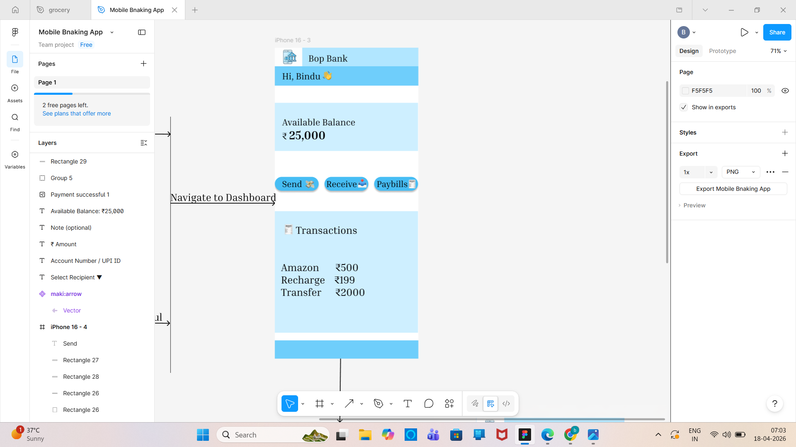
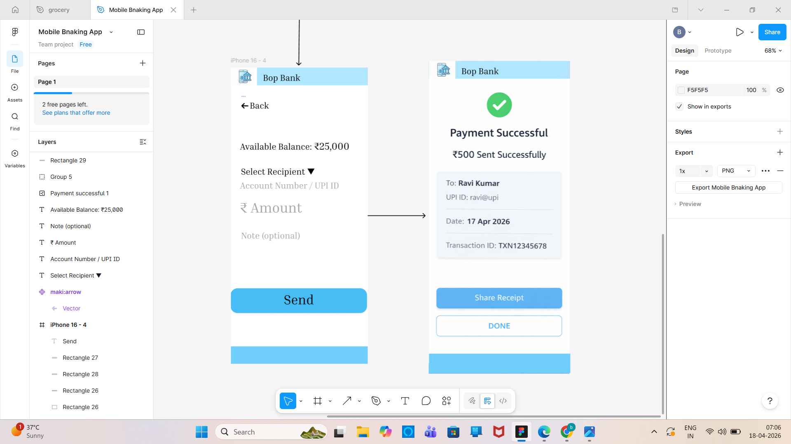

# 💳 Mobile Banking App UI (Beginner Project)

This is my beginner-level UI/UX design project where I tried to design a simple **Mobile Banking Application** using Figma.

I am currently learning UI/UX design, and this project helped me understand how real apps are structured and how user flows work.

## 📌 About the Project

In this project, I created basic screens of a banking app where users can:

* View account balance
* Send money
* Enter recipient details
* See payment success confirmation

This is not a fully developed app — it is only a **UI design (wireframe + visual design)**.

## 🖼️ Screens Included

* Dashboard Screen
* Send Money Screen
* Payment Success Screen

(Add your images below 👇)

---

## 🎯 What I Learned

* Basics of UI/UX design
* How to design simple user flows
* Importance of spacing and layout
* Creating clean and minimal screens
* Using Figma for design

---

## 🛠️ Tools Used

* Figma

---

## 🚀 Future Improvements

* Improve UI design (colors, spacing, alignment)
* Add more screens
* Learn prototyping
* Convert this design into code

---

## 🙌 Note

This is a beginner project and part of my learning journey.
I am continuously improving my skills and working on better designs.

---

## 👤 Author

Bindu
